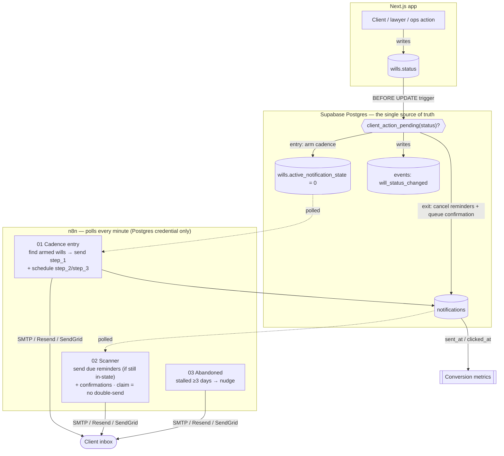

# InstaWill — client-notification automation (n8n)

**One event stream drives both the metrics dashboard and this n8n notification
automation.** The intelligent structuring stays in custom code (the LLM); the
operational comms are a visible no-code workflow that fires on the right state
transitions, reminds on a cadence, and cancels itself when the client acts.

What makes this an automation, not a "send": the value is in the **trigger
discrimination** (it knows when *not* to email), the **reminder loop**, and the
**loop closure** — not the email itself.

> **Design: polling, no webhook.** The DB trigger does the smart bookkeeping
> (arms a cadence on entry, cancels it on exit, queues the confirmation). n8n
> just polls two simple queries on a 1-minute schedule. This needs **only the
> Postgres credential** — no Supabase Database Webhook, no `pg_net`, no
> `supabase_functions`. (If you ever want push/real-time instead of ≤60 s
> latency, see "Optional: push instead of poll" at the bottom.)

---

## Architecture



**Guard — fire ONLY on client-action-pending states.** Computed once in
Postgres (`client_action_pending()`), so "knowing not to send" is a property of
the data model:

| Will status | Email? | Template |
|---|---|---|
| `documents_pending` | ✅ | "Finish your documents" |
| `awaiting_client` (clarification) | ✅ | "Your lawyer has a question" |
| `pending_client_approval` | ✅ | "Your will is ready — review & approve" |
| `changes_requested` | ✅ | "A change was requested" |
| stalled ≥3 days mid-intake | ✅ | re-engagement nudge (workflow 03) |
| `in_review`, `lawyer_approved`, `portal_ready`, `registered`, `draft`, … | 🚫 **never** | a "your turn" email on a staff-side state erodes trust |

The clarification send (§1B-ter) and the re-engagement reminders (§1C) both route
through **this one system** — not a second email path.

---

## How the loop works (the impressive part)

1. **Entry.** The client's will moves into a pending state → the DB trigger sets
   `active_notification_state` and `notification_count = 0`. Workflow **01** finds
   it (`count = 0`), sends **step_1**, pre-schedules **step_2 (+2d)** and
   **step_3 (+5d)**, and bumps `notification_count = 1` (so it never re-sends).
2. **Remind.** Workflow **02** sends step_2 / step_3 when due — but only while the
   will is *still* in that state.
3. **Cancel.** The moment the client acts, the status changes and the DB trigger
   **cancels every un-sent reminder** for that will — atomically, in one write.
4. **Close.** That same trigger **queues a confirmation** (due now); workflow 02
   sends the "thanks, we've got it" email. The automation knows its job is done.

Idempotency lives in the DB: `notification_count` gates step_1; a conditional
`claim` update (`set sent_at = now() where sent_at is null`) gates every send, so
overlapping runs can never double-send.

---

## The three workflows

| # | File | Trigger | Job |
|---|---|---|---|
| 01 | `workflows/01_cadence_entry.json` | Schedule, every 1 min | Find armed wills, send step_1, schedule step_2/step_3. |
| 02 | `workflows/02_scanner.json` | Schedule, every 1 min | Send due reminders (if still in-state) **and** confirmations; claim → no double-send. |
| 03 | `workflows/03_abandoned_scanner.json` | Schedule, daily | Nudge leads that started intake and went quiet ≥3 days. |

---

## Setup

### 1. Apply the trigger (one-time)
Run **`migration_notification_trigger.sql`** in the Supabase SQL editor. It
upgrades the status trigger to queue confirmations for the polling design. Safe —
`create or replace function` only, no data touched. (Fresh installs from
`supabase/schema.sql` already include it.)

### 2. One credential in n8n
- **Postgres** → your Supabase project. Use the **Session pooler** (IPv4):
  host `aws-0-<region>.pooler.supabase.com`, port **5432**, database `postgres`,
  user **`postgres.<project-ref>`**, your DB password, SSL **require**. (The
  direct `db.<ref>.supabase.co` host is IPv6-only and fails on most networks.)
- **SMTP** (or Resend / SendGrid) for the email nodes; set a real `fromEmail`.
- Set an `APP_URL` env var in n8n (e.g. `https://app.instawill.ae`) for portal links.

### 3. Import & activate
Import the three files from `workflows/`, pick your credentials on the red nodes,
and toggle each workflow **Active**. That's it — no webhook to configure.

---

## The portal link
Each email carries **one** CTA: `{APP_URL}/portal/{will_id}?n={notification_id}`.
Passing `notification_id` lets a click stamp `clicked_at` (see `sql/tracking.sql`)
— the conversion signal. For real security, sign it or map to a short-lived token
rather than exposing the raw will id.

## Templates
All copy lives in **`templates.md`** (authored in the n8n nodes, per your choice).
One per trigger_state + a confirmation per resolved state. Tone matches the client
UI: calm, human, never make the client feel doubted. Vary the opener by
`sequence_step` (step_1 neutral → step_2 gentle → step_3 warmer/offers help).

## SQL (validated on Postgres 16 against `supabase/schema.sql`)
- `sql/cadence_entry.sql` — the entry poller + step_1 log + schedule reminders
- `sql/scanner.sql` — select-due (reminders + confirmations), the idempotent claim
- `sql/abandoned_scanner.sql` — the ≥3-day scan + log
- `sql/tracking.sql` — open/click stamping (optional)

> The workflow JSON embeds these as **inline expressions** so they import and run
> as a demo. For production, switch the Postgres nodes to **Query Parameters**
> (`$1, $2, …`) exactly as written in `sql/*.sql` — never string-concatenate
> client data into SQL.

---

## Metrics it unlocks (views already in `schema.sql`)
- `v_notification_conversion` — sent → clicked, per pending state ("did the email work?")
- `v_reminder_effectiveness` — clicks by cadence step (did step_1 do the job, or did it take a nudge?)
- `v_pending_state_distribution` — which state stalls most
- `v_recovery_rate` — abandoned/agent touches that recovered

## Testing without the app (state lives in localStorage until Stage 2)
Fire a real transition straight in Supabase and watch the workflows pick it up
within a minute:
```sql
do $$
declare v_lead uuid; v_will uuid;
begin
  -- Use delivered@resend.dev (Resend's test sink) or your own verified email.
  -- Resend's free tier blocks sends to @example.com and unverified domains.
  insert into leads (email, full_name, current_stage)
    values ('delivered@resend.dev', 'Test Client', 'review')
    returning id into v_lead;
  insert into wills (lead_id, status)
    values (v_lead, 'in_review')
    returning id into v_will;
  update wills set status = 'documents_pending' where id = v_will;  -- ARMS the cadence (workflow 01 sends step_1)
end $$;
```
Then flip it back (`update wills set status='in_review' …`) — the reminders
cancel and a confirmation queues (workflow 02 sends it). Clean up with
`delete from leads where email='delivered@resend.dev';`.

> **Note:** the app still writes to localStorage, so real user actions won't fire
> this yet — that's **Stage 2 (store → Supabase port)**, which also fixes
> `submitWill` collapsing `documents_pending` into `in_review` so a will actually
> *rests* in the pending state this workflow watches for.

---

## Optional: push instead of poll
Once you're comfortable, you can swap the 1-minute polling for real-time push:
enable the `pg_net` extension, then either (a) turn on **Database → Webhooks** and
POST `events` inserts to an n8n Webhook node, or (b) add a small `pg_net` trigger
that POSTs to n8n directly. The queries and templates don't change — only how
workflow 01 is *woken up*. Polling is the recommended starting point; it's
simplest and has no extra moving parts.
