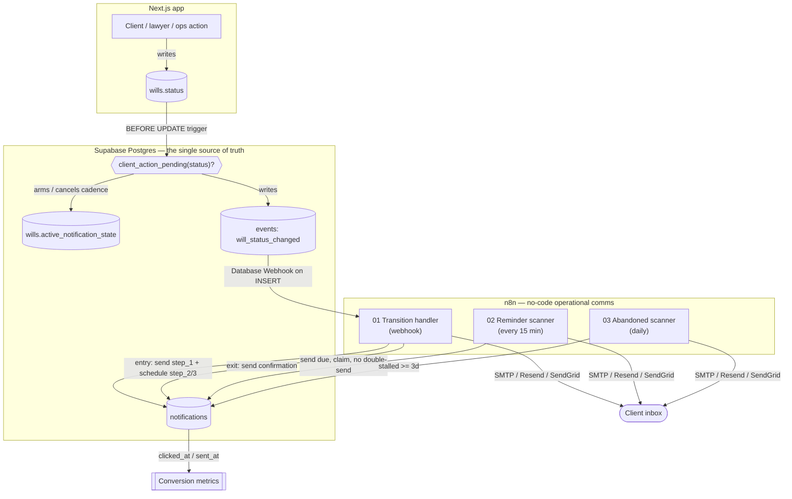

# InstaWill — client-notification automation (n8n)

**One event stream drives both the metrics dashboard and this n8n notification
automation.** The intelligent structuring stays in custom code (the LLM); the
operational comms are a visible no-code workflow that fires on the right state
transitions, reminds on a cadence, and cancels itself when the client acts.

What makes this an automation, not a "send": the value is in the **trigger
discrimination** (it knows when *not* to email), the **reminder loop**, and the
**loop closure** — not the email itself.

---

## Architecture



**Guard — fire ONLY on client-action-pending states.** The switch routes on
`client_action_pending`, computed once in Postgres (`client_action_pending()`):

| Will status | Email? | Template |
|---|---|---|
| `documents_pending` | ✅ | "Finish your documents" |
| `awaiting_client` (clarification) | ✅ | "Your lawyer has a question" |
| `pending_client_approval` | ✅ | "Your will is ready — review & approve" |
| `changes_requested` | ✅ | "A change was requested" |
| stalled ≥3 days mid-intake | ✅ | re-engagement nudge (workflow 03) |
| `in_review`, `lawyer_approved`, `portal_ready`, `registered`, `draft`, … | 🚫 **never** | — a "your turn" email on a staff-side state erodes trust |

The clarification send (§1B-ter) and the re-engagement reminders (§1C) both route
through **this one system** — not a second email path.

---

## The three workflows

| # | File | Trigger | Job |
|---|---|---|---|
| 01 | `workflows/01_transition_handler.json` | Supabase Database Webhook → n8n webhook | On **entry** to a client-pending state: send step_1 immediately + pre-schedule step_2 (+2d) / step_3 (+5d). On **exit** (client acted): send the confirmation. |
| 02 | `workflows/02_reminder_scanner.json` | Schedule, every 15 min | Send the due reminders — but only if the will is *still* in that state. A "claim" update guarantees no double-send. |
| 03 | `workflows/03_abandoned_scanner.json` | Schedule, daily | Nudge leads that started intake and went quiet ≥3 days. |

**The loop (the impressive part):** step_1 on transition → step_2/step_3 pre-scheduled → **the DB trigger cancels every un-sent reminder the instant the state changes** → confirmation on close. Cancellation is atomic and lives in Postgres, so it's correct even if n8n misses a beat.

---

## Setup

### 0. Apply the trigger enhancement (one-time, if not already)
Run **`migration_add_from_pending.sql`** in the Supabase SQL editor. It adds
`from_client_action_pending` to the event payload (used for the confirmation
branch). Safe — it's a `create or replace function`, no data touched. Fresh
installs from `supabase/schema.sql` already have it.

### 1. Point Supabase at n8n (the trigger source)
Import `workflows/01_transition_handler.json`, open the **Webhook** node, copy its
**Production URL**. Then in Supabase: **Database → Webhooks → Create** →
- Table: `events`, Events: **Insert**
- Type: **HTTP Request**, Method **POST**, URL: the n8n webhook URL.

Every row InstaWill writes to `events` now POSTs to n8n. The workflow's first IF
drops everything except `event_type = 'will_status_changed'`, so noise is cheap.
*(Alternative: skip the webhook and give n8n a Postgres/Supabase Realtime trigger
— the workflow logic is identical.)*

### 2. Credentials in n8n
- **Postgres** (or Supabase) credential → your project's connection string. n8n
  uses this to read `events`/`notifications` and write sends. Use the
  **`service_role`**/direct DB connection — it bypasses RLS. **Never** put that
  key in the app.
- **SMTP** (or Resend / SendGrid) credential for the email nodes. Set a real
  `fromEmail` you're allowed to send from.
- Set an `APP_URL` env var in n8n (e.g. `https://app.instawill.ae`) for portal links.

### 3. Activate
Turn on all three workflows. Done.

---

## The portal link
Each email carries **one** CTA: a secure link back to the client's portal, e.g.
`{APP_URL}/portal/{will_id}?n={notification_id}`. Include the `notification_id`
so a click can stamp `clicked_at` (see `sql/tracking.sql`) — that's the
conversion signal. For real security, sign it or map to a short-lived token
rather than exposing the raw will id.

## Templates
All copy lives in **`templates.md`** (authored in the n8n nodes, per your
choice). One per trigger_state + a confirmation per resolved state. Tone matches
the client UI: calm, human, never make the client feel doubted. Vary the opener
by `sequence_step` (step_1 neutral → step_2 gentle → step_3 warmer/offers help).

## SQL
Every Postgres-node query, validated against `supabase/schema.sql` on Postgres 16:
- `sql/transition_handler.sql` — step_1 log, schedule reminders, confirmation
- `sql/reminder_scanner.sql` — select-due, the idempotent **claim**, counter bump
- `sql/abandoned_scanner.sql` — the ≥3-day scan + log
- `sql/tracking.sql` — open/click stamping (optional)

> The workflow JSON embeds these as **inline expressions** so they import and run
> as a demo. For production, switch the Postgres nodes to **Query Parameters**
> (`$1, $2, …`) exactly as written in `sql/*.sql` — never string-concatenate
> client data into SQL.

---

## Metrics it unlocks (views already in `schema.sql`)
- `v_notification_conversion` — sent → clicked, per pending state ("did the email work?")
- `v_reminder_effectiveness` — clicks by cadence step (did step_1 do the job, or did it take a nudge?)
- `v_pending_state_distribution` — which state stalls most
- `v_recovery_rate` — abandoned/agent touches that recovered

## Testing without the app (state lives in localStorage until Stage 2)
Fire a real transition straight in Supabase and watch it flow:
```sql
do $$
declare v_lead uuid; v_will uuid;
begin
  insert into leads (email, full_name, current_stage) values ('you@example.com','Test Client','review') returning id into v_lead;
  insert into wills (lead_id, status) values (v_lead, 'in_review') returning id into v_will;
  update wills set status = 'documents_pending' where id = v_will;  -- ARMS the cadence + webhooks n8n
end $$;
```
Then flip it back (`update wills set status='in_review' …`) to see the reminders
cancel and the confirmation fire. Clean up with
`delete from leads where email='you@example.com';`.

> **Note:** the app still writes to localStorage, so real user actions won't fire
> this yet — that's **Stage 2 (store → Supabase port)**, which also fixes
> `submitWill` collapsing `documents_pending` into `in_review` so a will actually
> *rests* in the pending state this workflow watches for.
